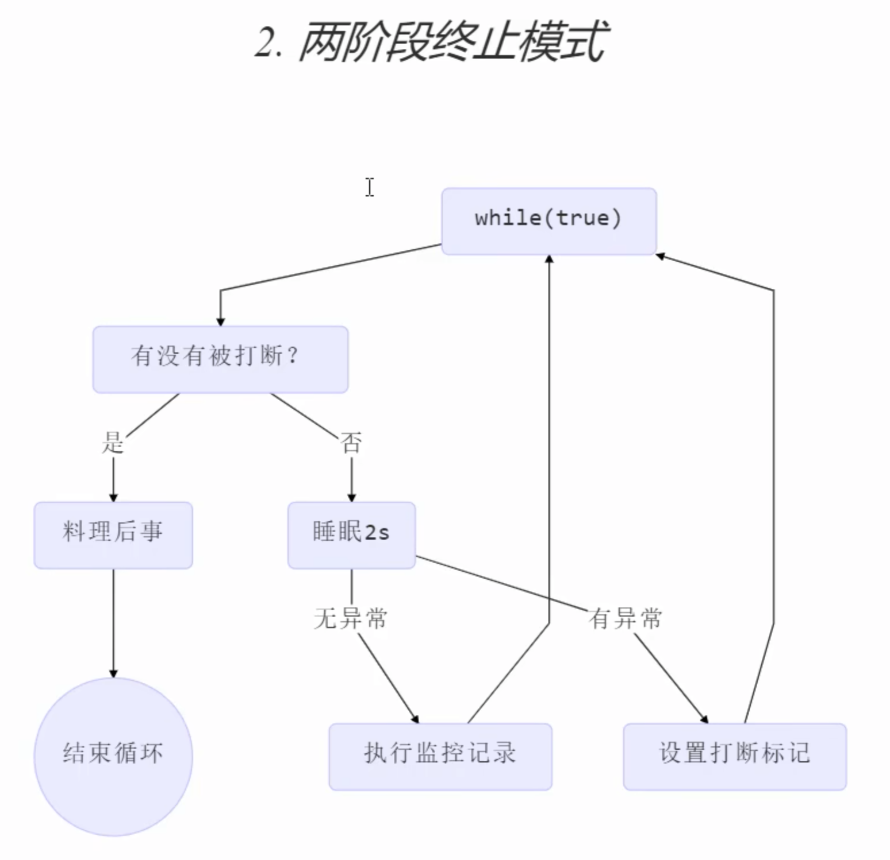

## ## 创建线程

## 多线程

## 原理之线程运行

### 栈与栈帧

### Thread Context Switch

## start vs run

- 创建一个线程需要重写run()方法, 如果你在main方法中创建了这个线程, 然后再调用run()方法, 其实还是在main线程内.
- start()方法只能调用一次

```java
sout(t1. getState())
t1.start();
sout(t1.getState())

// output
NEW
RUNNABLE
```

## yield vs sleep

### Sleep

- sleep 后线程状态 -> `Timed Waiting`
- 线程调用interrupt()方法会抛出InterruptedException异常
- 睡眠结束后线程未必立刻得到执行

#### 应用

在没有利用cpu计算时, 不要让while(true) 空转浪费cpu, 这时可以使用sleep或者yield来让出cpu的使用权给其他程序

```java
while(true) {
	try {
		Thread.sleep(50);
	} catch(..) {..}
}
```

也可以用wait或条件变量, 但是这些需要加锁. sleep适用于无需锁同步的场景

### Yield

- 调用yield 从Running -> Runnable(就绪状态), 然后调度执行其他线程( 还是有可能执行该线程)
- 具体的实现依赖于操作系统的任务调度器

## join

t1启动后调用t1.join(), 会等到该线程运行结束. 

### Join应用: 同步

- 需要等待结果返回, 才能继续运行就是同步
- 不需要, 异步

多个线程进行join(), 并不会串行执行, 会多线程同步执行


### 有时效的join

## Interrupt

### 应用: 两阶段终止  Two Phase Termination

如何在线程T1中优雅的终止线程T2(给T2一个料理后事的机会)

1. 错误思路

- 使用stop() 会真正杀死线程
- 使用system.exit() 会关闭jvm

---



每隔2s执行监控, 但也要有逻辑能够让它停止.
